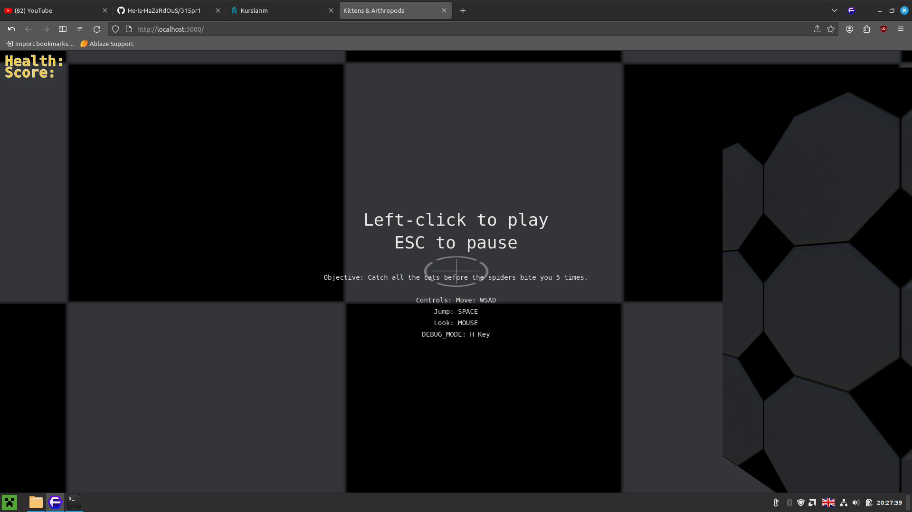
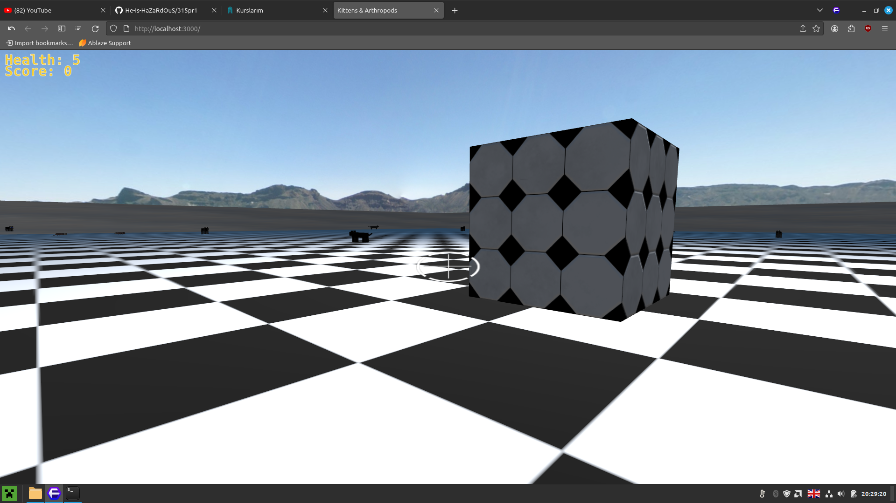
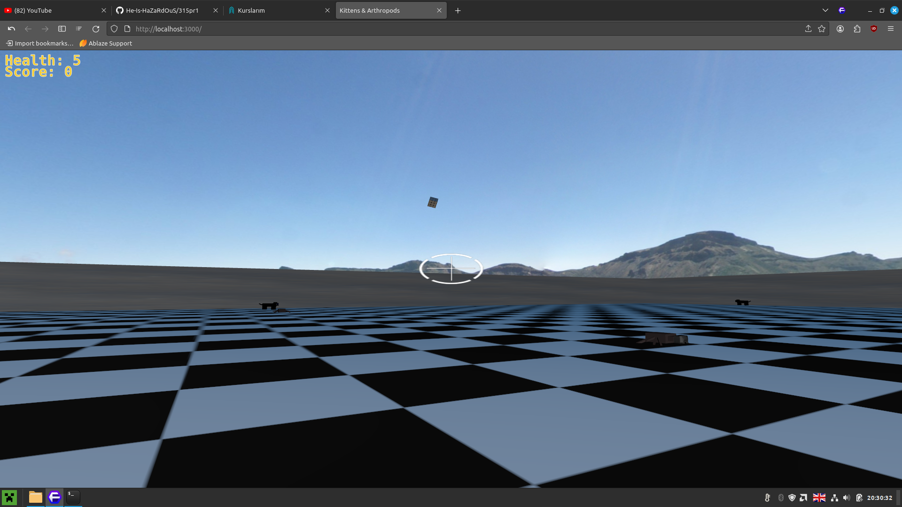
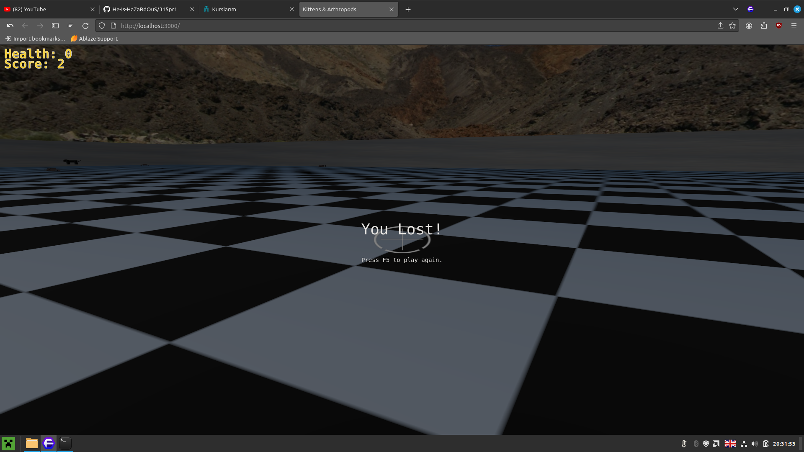
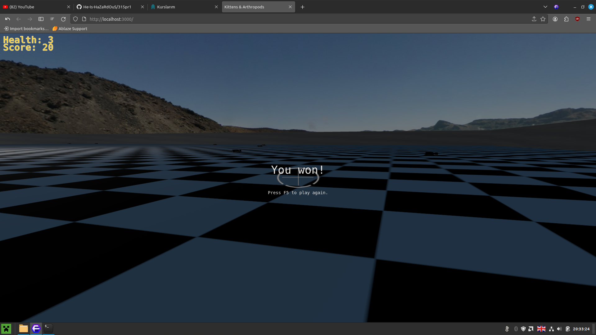

# 315pr1
placeholder repository for CENG315's final assignment. </br>

## Installing && Running
1. Clone this repo to your computer. </br> </br>
2. Install Node.js and NPM. </br>
### (Windows && MacOS)
https://nodejs.org/en/download/ </br>
### (Ubuntu Linux)
https://linuxize.com/post/how-to-install-node-js-on-ubuntu-20-04/ </br> </br>
3. cd into the project root.

```bash
cd 315pr1
```
</br>
4. Run the commands below to install dependencies.

```bash
npm install cannon-es
npm install parcel
npm install three
```
</br>
5. Start a local server using parcel.
   
```bash
npx parcel src/main.html --port 3000
``` 
CTRL + C to terminate it. <br>
If localhost refused to connect, change the port and try again. </br> </br>
6. Open the generated http link in your browser. </br> </br>
7. ??? </br> </br>
8. Profit! </br> </br>

# Screenshots
Splash Screen

Game snippet 1

Game snippet 2 (flung cube)

Death/loss screen

Win screen


## TODO
- [x] Establish Solid 2D Plane.
- [x] Get Camera and WSAD Movements.
- [x] Import 3D Models.
- [x] Implement Collision Logic.
- [ ] TBD...

## Group Members
- 21050141038 Yousif Harith Suhail Suhail </br>
- 20050141056 Firuza Rahimova </br>
- 18050111038 Murat Ergin </br>

## Game Description
The game is set in a floating sandbox </br>
The floor is filled with cats and spiders </br>
The player is tasked with the objective of catching all the cats while avoiding the spiders </br>
Failure to do so will result in a "Game Over" screen </br>
Otherwise the Win Exit condition is satisfied </br>

## Tech
Three.js and Cannon.js were used to create the sandbox </br>
Cat and Spider models were created personally </br>
Several other assests were found online along with their respective (albedo, roughness, metallic, normal,...) maps </br>
A seamless skybox was used </br>
HemiSphericLight and Spotlight are used to illuminate the world </br>
Entities and Surface objects have fully-integrated physics systems courtesy of Cannon.js </br>
Debug mode showing the wireframe hitbox of entities is included for funsies </br>
